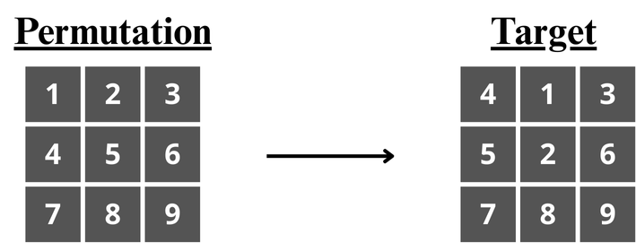
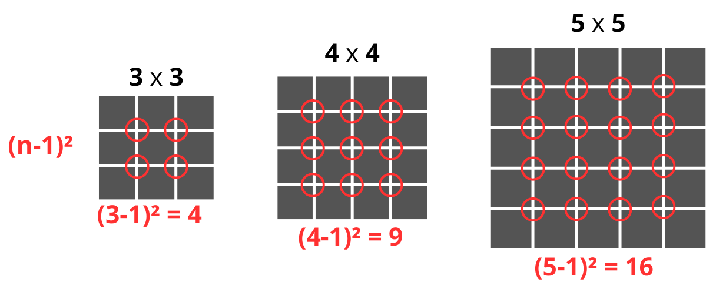
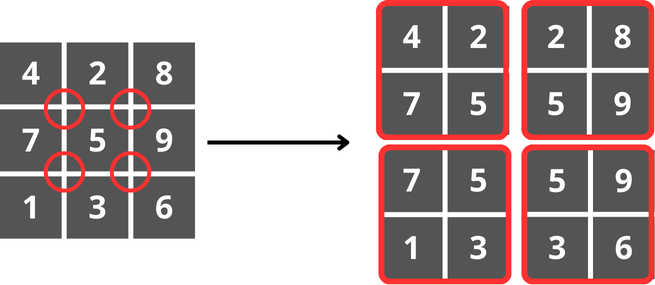
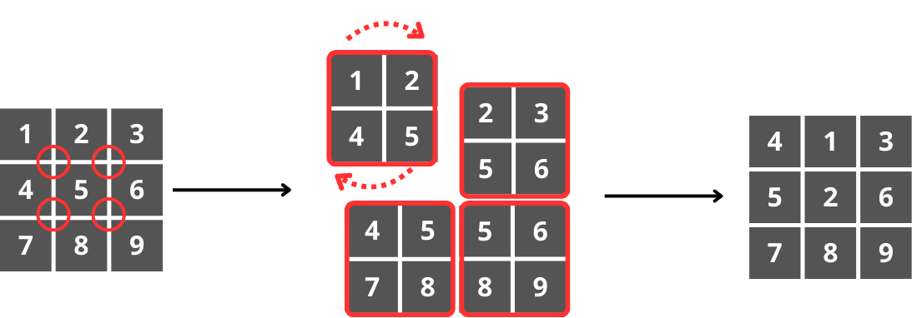

# 𝄃𝄃𝄂𝄂𝄀𝄁𝄃𝄂𝄂𝄃 Matrix Permutation Puzzle — BFS Approach (NP Problem)

## Overview

This project addresses an **NP problem** consisting of transforming a permuted square matrix into a target matrix using **2×2 submatrix rotations**.
The problem is solved using **Breadth-First Search (BFS)** over the implicit state space, ensuring optimal (minimum-length) solutions when they exist.

The project focuses not only on implementation, but also on the **algorithmic design decisions** required to efficiently explore and verify solutions in a combinatorial state space.

---

## Complexity Classes: P and NP

Before introducing the problem, it is useful to recall the definition of the main complexity classes involved.

### Class P

$$
P = { \text{problems that can be solved in polynomial time} }
$$

These problems admit algorithms whose **execution time** is bounded by a **polynomial** function of the input size.

### Class NP

$$
NP = { \text{problems whose solutions can be verified in polynomial time} }
$$

For NP problems, finding a solution may be computationally hard, but **given a candidate solution**, its correctness can be checked efficiently.

Classic NP problems include:

* The Hamiltonian Cycle problem.
* Graph coloring.
* Boolean satisfiability.

The problem studied in this project also belongs to this class.

---

## Problem Definition: **Matrix Permutation Transformation**

### Problem Statement

Given:

* A **square matrix** that is a permutation of a target matrix.
  
* **Both** matrices contain exactly the **same** **elements**, **arranged differently**.

### Objective

Transform the initial matrix into the target matrix using **only rotations of internal 2×2 submatrices**.

Each rotation affects exactly four elements and produces a new matrix configuration (state).

<div align="center">
  
</div>

---

## State Space and Solution Space

### Number of Possible Configurations

For a general ( n × n ) matrix, there are ( n^2 ) positions.
The total number of possible permutations is:

$$
(n^2)!
$$

For a ( 3 × 3 ) matrix:

$$
(3^2)! = 9! = 362{,}880
$$

This illustrates that even for small matrix sizes, the state space is extremely large.

---

### 2×2 Submatrices and Branching Factor

In an ( n × n ) matrix, the number of internal 2×2 submatrices is:

$$
(n - 1)^2
$$

Each of these submatrices represents a **possible rotation move**, meaning that from any given state, up to ( (n - 1)^2 ) new states can be generated.

<div align="center">
  
</div>

#### Illustration of 2×2 Submatrices

<div align="center">
  
</div>


This value acts as the **branching factor** of the search tree.
If a solution requires ( k ) rotations, the number of explored states may grow on the order of:

$$
((n - 1)^2)^k
$$

This **exponential growth** explains why the problem is difficult to solve via exhaustive search.

---

## Why the Problem Belongs to NP

To prove that a problem belongs to NP, it is not necessary to show that it is hard to solve, but rather that **a proposed solution can be verified in polynomial time**.

### Candidate Solution

A candidate solution consists of:

* A **sequence of 2×2 rotations**.

### Verification Procedure

1. Apply each rotation to the initial matrix.
2. Each rotation affects only four elements → **O(1)**.
3. For a sequence of ( k ) rotations → **O(k)**.
4. Compare the resulting matrix with the target matrix → **O(n^2)**.

### Total Verification Cost

$$
O(k + n^2)
$$

Since this cost is polynomial, the problem belongs to **NP**.

---

## Algorithmic Approach: Breadth-First Search (BFS)

### Why BFS?

* All moves have equal cost.
* BFS guarantees the **shortest sequence of rotations**.
* Suitable for unweighted graphs and state spaces.

The matrix configurations form an **implicit graph**:

* **Nodes** → matrix states.
* **Edges** → 2×2 rotations.

The graph is not stored explicitly; neighbors are generated dynamically.

---

## State Representation and Hashing

### Dual Representation Strategy

Two representations are used:

1. **Operational representation**

   * `NumPy arrays`
   * Used for efficient matrix manipulation and rotations.

2. **Logical state representation**

   * Immutable **tuples**
   * Used for hashing, comparison, and storage.

Example:

$$
\begin{bmatrix}
1 & 2 & 3 \\
4 & 5 & 6 \\
7 & 8 & 9
\end{bmatrix}
\longrightarrow
(1,2,3,4,5,6,7,8,9)
$$

---

### Visited Set

To avoid cycles and redundant exploration, all discovered states are stored in a `set`:

* Tuples are immutable and hashable.
* Python uses their hash internally for **O(1)** membership checks.
* A state is marked as visited when it is **enqueued**, not when it is expanded.

This ensures efficient pruning of the search tree.

---

## Rotation Operator Design

The rotation logic operates on matrices, as this is the most natural representation for manipulating submatrices.

<div align="center">
  
</div>


To integrate this with BFS:

* The current state (tuple) is converted into a matrix.
  
* The rotation is applied.
  
* The resulting matrix is converted back into a tuple.

This preserves efficiency while maintaining correct state tracking.

---

## BFS Workflow Summary

1. Initialize the queue with the initial state.
2. Store the initial state in the visited set.
3. While the queue is not empty:

   * Dequeue a state.
   * Check if it matches the target.
   * Generate all successor states via rotations.
   * Enqueue unseen states and mark them as visited.
4. Stop when the target is found or the search space is exhausted.

---

## Structure and Execution

### Project Structure

This project is intended to be read in the following order:

1. **README.md** — Provides the theoretical background, problem definition, and overall design rationale.
   
2. **implementation.ipynb** — Core of the project, where the algorithm is developed step by step and key design decisions are discussed.
   
3. **matrix_permutation.py** — Final standalone implementation, including a performance test that analyzes how execution time grows as the number of required rotations increases.

### **EXECUTION**

This project includes a `requirements.txt` file listing the required dependencies.

To install them, run:

```bash
python -m pip install -r requirements.txt
```

The notebook was developed and tested on a Linux environment, but the dependency setup is **fully cross-platform** (Linux, Windows, macOS), assuming a valid Python installation.

---

## Conclusion

This project demonstrates how an NP problem can be approached using classical algorithmic techniques such as BFS, combined with careful **state representation**, **hash-based pruning**, and **clear separation between operational and logical structures**.

Although the solution space grows exponentially, the algorithm efficiently explores feasible configurations and guarantees correctness and optimality when a solution exists.


